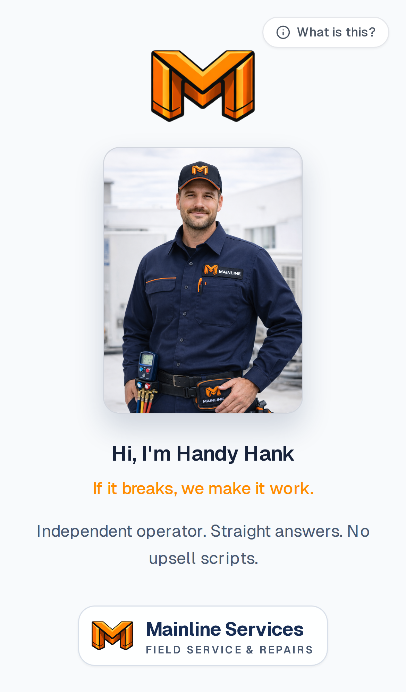
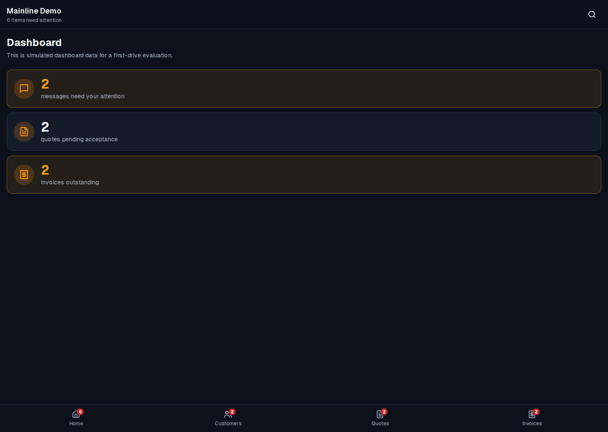
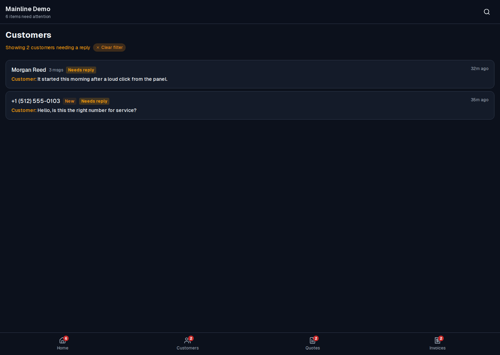
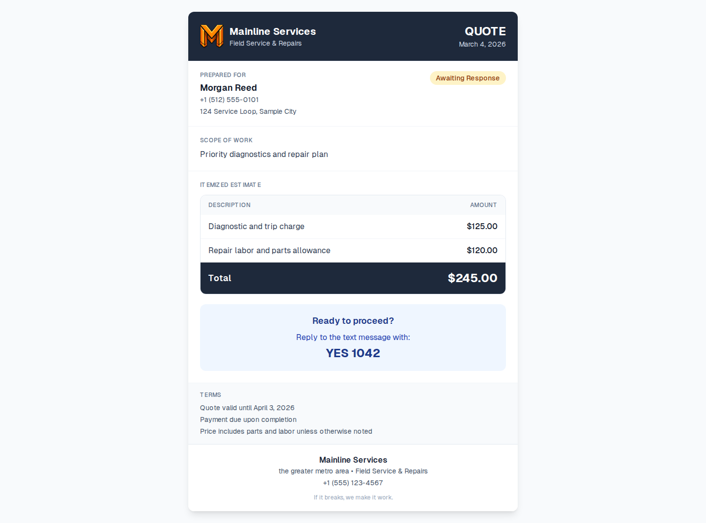
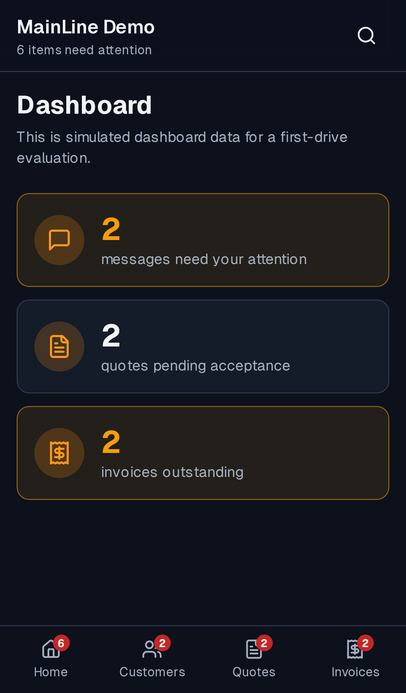
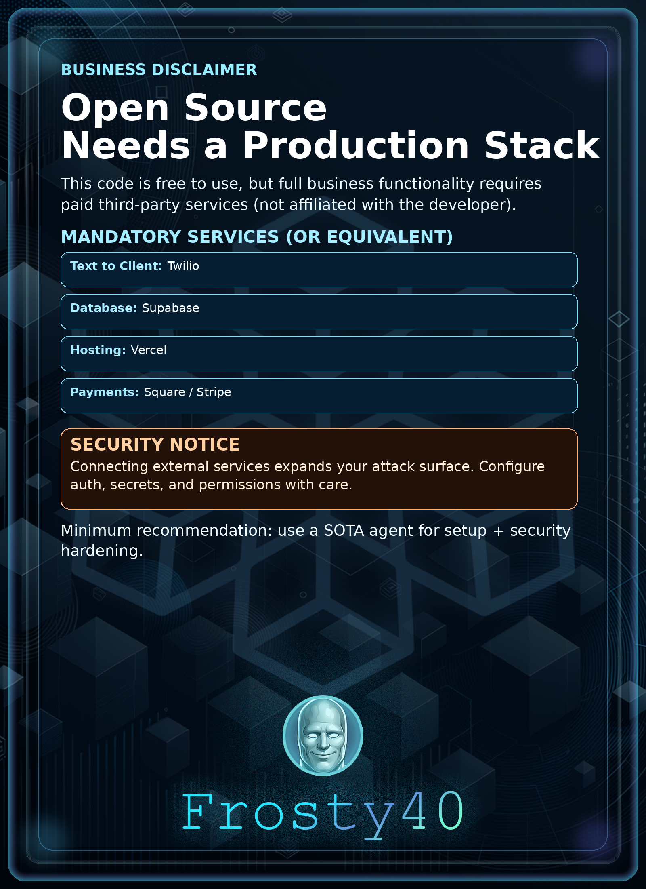

<p align="center">
  
</p>

<h1 align="center">MainLine</h1>

<p align="center">
  <strong>Open-source text-to-payment system for field contractors.</strong><br/>
  MainLine turns inbound SMS into customer records, then helps you reply, quote, invoice, collect payment, and follow up — all from one dashboard.
</p>

<p align="center">
  <a href="https://mainline-drab.vercel.app" target="_blank" rel="noopener noreferrer"></a>&nbsp;
  <a href="LICENSE" target="_blank" rel="noopener noreferrer"></a>&nbsp;
  &nbsp;
  
</p>

---

## ✨ What is MainLine?

MainLine is an **open-source text-to-payment system** for field contractors and small contractor teams. It replaces the patchwork of text messages, notes, spreadsheets, and invoicing tools with a single workflow:

> **Text → Customer Record → Quote → Invoice → Payment → Done.**

1. A customer texts your business number.
2. MainLine creates or updates the customer record automatically.
3. You reply from the dashboard, gather job details, and send quick responses.
4. You generate quotes, send invoices, collect payment, and keep the full job history attached to the account.

## 🔑 Key Features

| Feature | Description |
| :--- | :--- |
| **SMS → Customer Record** | Inbound texts automatically create or update customer profiles |
| **Guided Intake** | Quick replies and conversation stages help operators move faster |
| **Quotes & Invoices** | Draft, send, accept, and track — all from the same app |
| **Customer Context** | Messages, photos, addresses, and documents stay tied to each account |
| **Demo Mode** | Evaluate the full product locally or online — no live credentials needed |

## 📸 Screenshots

| Dashboard | Customer Queue |
| :---: | :---: |
|  |  |
| **Quote Document** | **Mobile Dashboard** |
|  |  |

> Browse the full product storyboard in <a href="docs/screenshots" target="_blank" rel="noopener noreferrer"><code>docs/screenshots</code></a>.

---

## 🚀 Quick Start

### Try the Demo

**Live demo →** <a href="https://mainline-drab.vercel.app" target="_blank" rel="noopener noreferrer">mainline-drab.vercel.app</a>

**Run locally** — sample customers, messages, quotes, invoices, and photos included:

```bash
git clone https://github.com/newjordan/mainline.git
cd mainline
npm install
npm run demo
```

Then open <a href="http://localhost:3000/demo/login" target="_blank" rel="noopener noreferrer"><code>http://localhost:3000/demo/login</code></a>.

### Prerequisites

- **Node.js** 20+
- **npm**

---

## ⚙️ Setup & Configuration

### Demo Mode (no credentials required)

```bash
npm run demo
```

That's it. No Supabase, Twilio, or payment keys needed.

### Live Mode

1. Copy `.env.example` → `.env.local`
2. Fill in the values for the providers you want to use
3. Run the setup wizard: `npm run wizard:setup`
4. Start the app: `npm run dev`

### Required & Optional Services

| Service | Purpose | Required |
| :--- | :--- | :---: |
| <a href="https://supabase.com" target="_blank" rel="noopener noreferrer">Supabase</a> | Database, auth, storage | ✅ Yes |
| <a href="https://www.twilio.com" target="_blank" rel="noopener noreferrer">Twilio</a> | SMS / MMS send + receive | ✅ Yes |
| <a href="https://vercel.com" target="_blank" rel="noopener noreferrer">Vercel</a> | Recommended deployment target | Recommended |
| <a href="https://squareup.com" target="_blank" rel="noopener noreferrer">Square</a> | Hosted payment links for invoices | Optional |

> Set `PAYMENT_PROVIDER=none` if you do not want online payments.
>
> `ALLOWED_EMAILS` controls dashboard access. If empty, access fails closed.

### Environment Notes

- <a href=".env.example" target="_blank" rel="noopener noreferrer"><code>.env.example</code></a> is the source of truth for all supported variables.
- **Demo:** keep `DEMO_MODE=true` and use sample-only data.
- **Live:** set `DEMO_MODE=false` and use real provider credentials.
- Never commit `.env.local`, production secrets, or real customer data.

---

## 📜 Available Scripts

| Command | Purpose |
| :--- | :--- |
| `npm run dev` | Start the development server |
| `npm run demo` | Start the local demo experience |
| `npm run build` | Create a production build |
| `npm run lint` | Run ESLint |
| `npm test` | Run the test suite |
| `npm run wizard:setup` | Guided setup flow |
| `npm run wizard:setup -- --doctor` | Re-check and repair config |
| `npm run template:import -- <file>` | Import a business profile template |
| `npm run screenshots:desktop` | Capture desktop product screenshots |
| `npm run screenshots:mobile` | Capture mobile product screenshots |

---

## 🗂️ Project Layout

```
app/           → Next.js App Router routes
components/    → UI and workflow components
lib/           → Actions, integrations, services, validation, utilities
docs/          → Onboarding, deployment, and integration docs
supabase/      → Supabase config and migrations
tests/         → Node test suite
```

---

## 📖 Documentation

- <a href="docs/onboarding-mainline.md" target="_blank" rel="noopener noreferrer">Onboarding Guide</a>
- <a href="docs/deployment.md" target="_blank" rel="noopener noreferrer">Deployment Guide</a>
- <a href="docs/integration-checklists.md" target="_blank" rel="noopener noreferrer">Integration Checklists</a>
- <a href="CONTRIBUTING.md" target="_blank" rel="noopener noreferrer">Contributing Guide</a>
- <a href="SECURITY.md" target="_blank" rel="noopener noreferrer">Security Policy</a>

---

## 🤝 Contributing

PRs are welcome! Please keep changes focused, avoid committing secrets, and run the smallest relevant checks before opening a pull request.

See <a href="CONTRIBUTING.md" target="_blank" rel="noopener noreferrer"><code>CONTRIBUTING.md</code></a> for contributor workflow and review expectations.

## 🔒 Security

Please do **not** report vulnerabilities in public issues. Use the process described in <a href="SECURITY.md" target="_blank" rel="noopener noreferrer"><code>SECURITY.md</code></a>.

## 📄 License

<a href="LICENSE" target="_blank" rel="noopener noreferrer">MIT</a>

## ⚖️ Compliance Note

If you deploy MainLine for a real business, you are responsible for reviewing SMS consent, privacy, billing, and local regulatory requirements for your market.

---

## ⚠️ Disclaimer

<p align="center">
  
</p>
